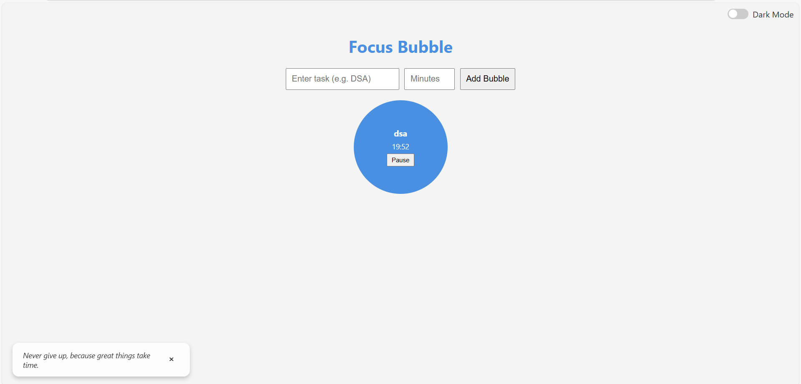
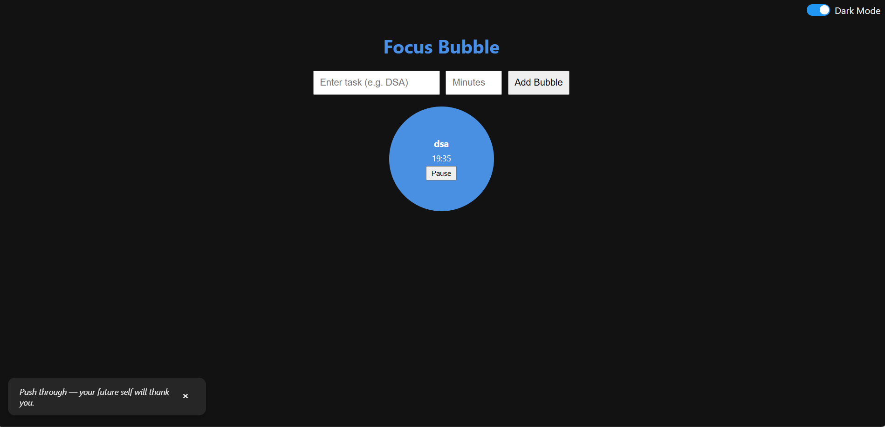

# 🎯 Focus Bubble

**Focus Bubble** is a minimalist task-timer app that turns your focus sessions into visual bubbles. Stay on track, stay motivated.

---

## 🔗 Live Demo

[Click here to use Focus Bubble](https://shrutibhardwaj22.github.io/bubble-time/)

---

## 🔧 Features

- ⏳ Add tasks with a custom timer  
- ⏸️ Pause & resume countdown anytime  
- 🌗 Light and dark mode toggle  
- 💬 Auto-rotating motivational quotes  
- 🔔 Toast alerts on task completion  
- 💾 Tasks saved with localStorage  

---

## 📸 Screenshots

### Light Mode  

### Dark Mode  

---

## Quick Start

1. Open `index.html` in your browser.  
2. Add a task and set a time (1–120 minutes).  
3. Click **Add Bubble** to start your focus session.  

---

## 💡 Why I Built This

I was struggling to stay focused while studying. Every time I picked up my phone to check how much time had passed, I would get distracted and end up scrolling instead of studying.

That’s when I realized I needed a **dedicated focus timer on my laptop** — something simple, motivating, and always visible. So, I built **Focus Bubble** to help me stay on track and beat distractions.

---

## Creator

**Shruti Bhardwaj**  
B.Tech CSE | Developer & Productivity Enthusiast
